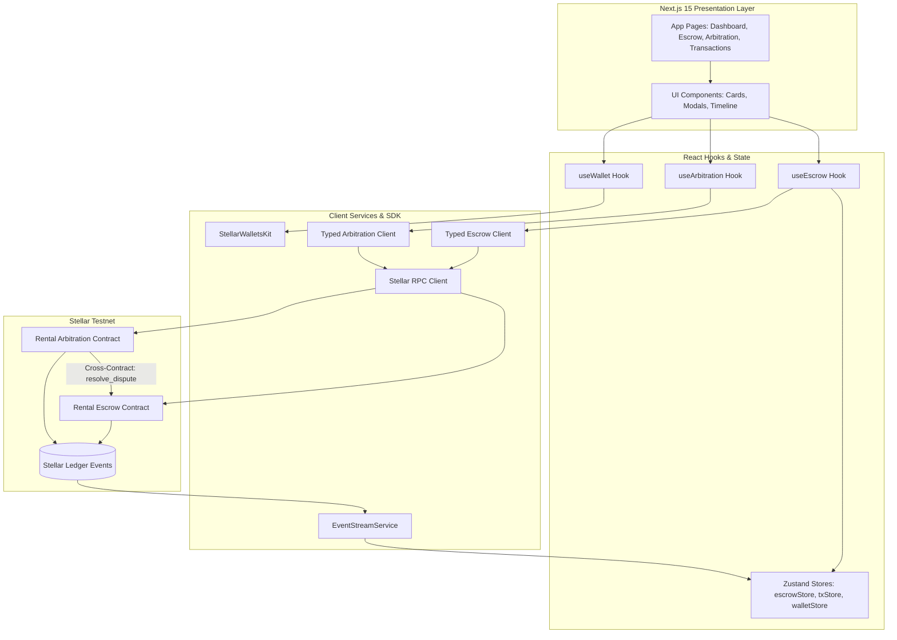

# Stellar Rental Deposit Escrow — Soroban Frontend Integration & Function Matching Guide

This document provides a comprehensive overview of how the **Stellar Rental Deposit Escrow (StellarVault)** frontend application integrates with Stellar Soroban smart contracts using `@creit.tech/stellar-wallets-kit`, `@stellar/stellar-sdk`, and typed contract services.

---

## 1. Overview of Soroban Smart Contracts

The Rental Deposit Escrow platform operates on two interconnected Soroban smart contracts written in Rust:

1. **RentalEscrow (`contracts/escrow`)**
   - Manages non-custodial security deposit lifecycles, locks funds, tracks inspection timelocks, enforces automatic release countdowns, and executes authorized release or arbitration disbursements.
2. **RentalArbitration (`contracts/arbitration`)**
   - Maintains bonded arbiter registries, manages dispute lifecycles with IPFS evidence hashes, and issues binding rulings via authorized cross-contract invocations to `RentalEscrow`.

---

## 2. Soroban Contract Function Matching Matrix

Below is the complete function-matching table mapping Rust Soroban contract functions to the corresponding TypeScript service methods, `@stellar/stellar-sdk` ScVal encodings, and React UI components / hooks:

| Soroban Contract Function | Contract Name | TypeScript Client Method | SDK Data Types & Call | UI Component / Hook |
| :--- | :--- | :--- | :--- | :--- |
| `initialize(admin)` | `RentalEscrow` | `escrowClient.initialize(admin)` | `Address(admin).toScVal()` | Setup & Deploy Scripts |
| `create_escrow(tenant, token, amount, inspection_days, arbiter_contract)` | `RentalEscrow` | `escrowClient.createEscrow(...)` | `Address(tenant)`, `Address(token)`, `nativeToScVal(amount, { type: 'i128' })`, `nativeToScVal(inspection_days, { type: 'u64' })` | `CreateLeaseWizard.tsx` / `useEscrow` |
| `deposit(escrow_id)` | `RentalEscrow` | `escrowClient.deposit(escrowId)` | `nativeToScVal(escrow_id, { type: 'u64' })`, SAC token allowance check | `EscrowCard.tsx` / `useEscrow` |
| `initiate_checkout(escrow_id)` | `RentalEscrow` | `escrowClient.initiateCheckout(escrowId)` | `nativeToScVal(escrow_id, { type: 'u64' })` | `ActionModals.tsx` / `useEscrow` |
| `release_deposit(escrow_id)` | `RentalEscrow` | `escrowClient.releaseDeposit(escrowId)` | `nativeToScVal(escrow_id, { type: 'u64' })` | `ActionModals.tsx` / `useEscrow` |
| `claim_auto_release(escrow_id)` | `RentalEscrow` | `escrowClient.claimAutoRelease(escrowId)` | `nativeToScVal(escrow_id, { type: 'u64' })` | `EscrowTimeline.tsx` / `useEscrow` |
| `raise_dispute(escrow_id, claim_amount, reason)` | `RentalEscrow` | `escrowClient.raiseDispute(...)` | `nativeToScVal(claim_amount, { type: 'i128' })`, `nativeToScVal(reason, { type: 'string' })` | `DisputeModal.tsx` / `useEscrow` |
| `resolve_dispute(escrow_id, tenant_payout, landlord_payout)` | `RentalEscrow` | `escrowClient.resolveDispute(...)` | Cross-Contract Only (`RentalArbitration` caller verified) | Cross-Contract Invocations |
| `get_escrow(escrow_id)` | `RentalEscrow` | `escrowClient.getEscrow(escrowId)` | `simulateTransaction`, decodes `ScVal` to `EscrowRecord` | `EscrowDetails.tsx` / `useEscrow` |
| `initialize(admin)` | `RentalArbitration` | `arbitrationClient.initialize(admin)` | `Address(admin).toScVal()` | Setup & Deploy Scripts |
| `register_arbiter(arbiter, name, fee_bps)` | `RentalArbitration` | `arbitrationClient.registerArbiter(...)` | `Address(arbiter)`, `nativeToScVal(name, { type: 'string' })`, `nativeToScVal(fee_bps, { type: 'u32' })` | `ArbiterRegistry.tsx` / `useArbitration` |
| `open_dispute(escrow_contract, escrow_id, arbiter, claim_amount, ipfs_evidence_cid)` | `RentalArbitration` | `arbitrationClient.openDispute(...)` | `Address(escrow_contract)`, `nativeToScVal(escrow_id, { type: 'u64' })`, `Address(arbiter)`, `String(cid)` | `DisputeModal.tsx` / `useArbitration` |
| `submit_evidence(dispute_id, ipfs_evidence_cid)` | `RentalArbitration` | `arbitrationClient.submitEvidence(...)` | `nativeToScVal(dispute_id, { type: 'u64' })`, `String(cid)` | `EvidenceUploader.tsx` / `useArbitration` |
| `issue_ruling(dispute_id, tenant_payout, landlord_payout)` | `RentalArbitration` | `arbitrationClient.issueRuling(...)` | `nativeToScVal(dispute_id, { type: 'u64' })`, `nativeToScVal(tenant_payout, { type: 'i128' })` | `RulingConsole.tsx` / `useArbitration` |
| `get_dispute(dispute_id)` | `RentalArbitration` | `arbitrationClient.getDispute(disputeId)` | `simulateTransaction`, decodes `ScVal` to `DisputeRecord` | `DisputeDetails.tsx` / `useArbitration` |

---

## 3. Frontend Architecture Flow

---

## 4. Wallet & RPC Configuration

The application natively supports all major Stellar wallets using `@creit.tech/stellar-wallets-kit`:
- **Freighter**
- **xBull**
- **Albedo**
- **Hana**
- **Lobstr**

Transactions undergo strict **Simulation -> Footprint Generation -> User Signature -> Submission -> Ledger Confirmation Monitoring**.
