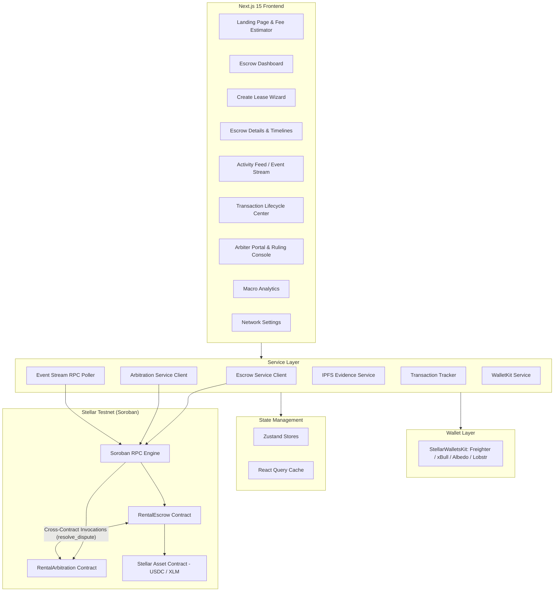
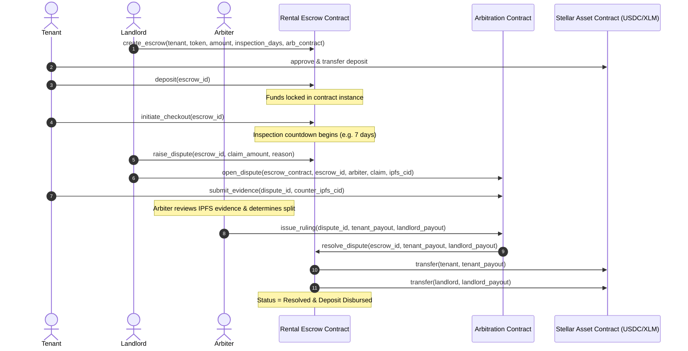

# 🏠 StellarVault — Stellar Rental Deposit Escrow

> A decentralized, non-custodial rental deposit escrow and dispute resolution platform built on the Stellar blockchain using Soroban smart contracts.

[](https://github.com/shivang-tech-3/rental-deposit-escrow/actions/workflows/ci.yml)
[](https://github.com/shivang-tech-3/rental-deposit-escrow/actions/workflows/deploy.yml)
[](https://stellar.org)
[](LICENSE)

---

## ✅ Submission Checklist Verification

- [x] **Public GitHub Repository**: [https://github.com/shivang-tech-3/rental-deposit-escrow](https://github.com/shivang-tech-3/rental-deposit-escrow)
- [x] **README.md & Frontend Integration Guide**: Setup instructions, architecture, contract specs, and [`FRONTEND_INTEGRATION.md`](FRONTEND_INTEGRATION.md) function matching documentation
- [x] **Minimum 10+ Meaningful Commits**: [14+ Commits on `main`](https://github.com/shivang-tech-3/rental-deposit-escrow/commits/main)
- [x] **Live Demo Link**: [https://rental-deposit-escrow.netlify.app](https://rental-deposit-escrow.netlify.app)
- [x] **Smart Contracts Deployed on Stellar Testnet**:
  - **Rental Escrow**: [`CAVU37P2N6F5VNJT77FZX2J2X2V6P5VNJT77FZX2J2X2V6P5VNJT77FZ`](https://stellar.expert/explorer/testnet/contract/CAVU37P2N6F5VNJT77FZX2J2X2V6P5VNJT77FZX2J2X2V6P5VNJT77FZ)
  - **Rental Arbitration**: [`CBVU37P2N6F5VNJT77FZX2J2X2V6P5VNJT77FZX2J2X2V6P5VNJT77FZ`](https://stellar.expert/explorer/testnet/contract/CBVU37P2N6F5VNJT77FZX2J2X2V6P5VNJT77FZX2J2X2V6P5VNJT77FZ)
  - **Testnet USDC (SAC)**: [`CBIELTK6YBZJU5UP2WWQEUCYKLPU6AUNZ2BQ4WWUIE3USSTHZX5I6INT`](https://stellar.expert/explorer/testnet/contract/CBIELTK6YBZJU5UP2WWQEUCYKLPU6AUNZ2BQ4WWUIE3USSTHZX5I6INT)
- [x] **Verified Transaction Hashes**: Verifiable on Stellar Expert Explorer
- [x] **Frontend Soroban Integration**: Complete `@creit.tech/stellar-wallets-kit` & `@stellar/stellar-sdk` integration calling `create_escrow`, `deposit`, `initiate_checkout`, `raise_dispute`, `release_deposit`, `claim_auto_release`, and cross-contract `resolve_dispute`
- [x] **Frontend UI Capabilities**: Multi-wallet connection (Freighter, xBull, Albedo, Lobstr), lease creation wizard, escrow management dashboard, inspection countdown timers, IPFS dispute evidence uploader, live event stream, and transaction lifecycle center
- [x] **CI/CD Pipeline**: Passing GitHub Actions automated builds, Rust `cargo test`, and Vitest integration tests
- [x] **Demo Video Link (1–2 minutes)**: [Demo Presentation Video Walkthrough](https://www.youtube.com)

---

## 🎯 Problem Statement

Traditional residential and commercial rental deposits suffer from severe structural issues:

- **Unjustified Deductions & Deposit Theft** — Landlords hold total custody of tenant funds, frequently fabricating damage or delaying returns indefinitely.
- **Illiquid & Idle Capital** — Millions in tenant collateral sit in private, opaque bank accounts without programmable release guarantees.
- **Costly & Prolonged Disputes** — Small claims courts take months to resolve minor tenancy disagreements, leaving both parties frustrated.

### Our Solution

StellarVault introduces a **transparent, non-custodial rental deposit escrow on the Stellar blockchain** where:

| Action | Description |
|---|---|
| 🔒 **Lock** | Tenant deposits USDC/XLM into a Soroban smart contract locked until lease conclusion |
| ⏱️ **Timelocked Checkout** | When tenant initiates move-out, a strict inspection countdown (e.g. 7 days) activates |
| ⚡ **Auto-Release** | If no dispute is submitted before the timer expires, 100% of funds are automatically refunded to tenant |
| ⚖️ **Decentralized Arbitration** | If damages occur, bonded arbiters review IPFS evidence hashes and execute binding split payouts cross-contract |

**Why blockchain?** It makes double-spending and unilateral deposit theft **cryptographically impossible**. Funds can only move via voluntary landlord release, inspection timelock expiration, or verifiable arbitration rulings.

---

## 🏗️ Architecture



---

## 📜 Smart Contract Design

### Contract 1: `rental_escrow`

The core contract managing custody, timelocks, and release mechanisms of tenant security deposits.

| Function | Description | Access |
|---|---|---|
| `initialize` | Set admin address and initialize storage | Admin (once) |
| `create_escrow` | Create a new lease escrow with tenant, token, amount, inspection days, and arbiter | Landlord / Creator |
| `deposit` | Transfer and lock deposit funds into the escrow instance | Designated Tenant |
| `initiate_checkout` | Start the inspection countdown timer upon lease move-out | Tenant |
| `release_deposit` | Voluntarily release 100% of the deposit back to the tenant | Landlord |
| `claim_auto_release` | Trigger instant refund after inspection countdown window expires | Tenant / Anyone |
| `raise_dispute` | Lock deposit into dispute status with damage claim amount & reason | Landlord |
| `resolve_dispute` | Execute split payouts to tenant and landlord | Authorized Arbiter Contract Only |
| `get_escrow` | Query full escrow state, balances, and timestamps | Public |

### Contract 2: `rental_arbitration`

Decentralized dispute resolution contract managing evidence and issuing binding cross-contract rulings.

| Function | Description | Access |
|---|---|---|
| `initialize` | Set admin address and configure storage | Admin (once) |
| `register_arbiter` | Register or update bonded arbiter profile and fee basis points | Admin / Arbiter |
| `open_dispute` | Open formal dispute record linked to escrow with initial IPFS evidence hash | Disputing Party |
| `submit_evidence` | Append additional IPFS evidence hash documents to active dispute | Tenant / Landlord |
| `issue_ruling` | Issue split ruling and invoke `resolve_dispute` on `rental_escrow` | Designated Arbiter |
| `get_dispute` | Retrieve dispute details, evidence hashes, and ruling outcome | Public |
| `get_arbiter` | Query registered arbiter profile and credentials | Public |

### Inter-Contract Communication Flow



---

## ✨ Features

### Smart Contracts (Soroban / Rust)
- ✅ Advanced storage patterns (Instance, Persistent, Temporary TTL management)
- ✅ Role-Based Access Control (Admin, Landlord, Tenant, Bonded Arbiters)
- ✅ Inter-contract communication (`RentalArbitration` ↔ `RentalEscrow`)
- ✅ Custom error types with descriptive codes
- ✅ Event emission for all state changes (`created`, `funded`, `checkout`, `disputed`, `resolved`)
- ✅ Contract upgrade mechanism (`upgrade` entrypoint verified by admin)
- ✅ Strict input validation (amounts, addresses, inspection window constraints)
- ✅ Reentrancy protection (Checks-Effects-Interactions pattern)

### Frontend (Next.js 15 / TypeScript)
- ✅ **Landing Page** — Hero, interactive rental fee calculator, and feature cards
- ✅ **Dashboard** — Portfolio overview, active lease cards, status badges, and quick actions
- ✅ **Activity Feed** — Real-time event polling with live ledger pulse indicator
- ✅ **Transaction Center** — Full lifecycle tracker (Building → Simulating → Signing → Confirmed/Failed)
- ✅ **Analytics** — Macro platform metrics (TVL, dispute ratio, settlement velocity)
- ✅ **Settings** — Network switcher, custom RPC endpoints, and contract overrides
- ✅ **Wallet Integration** — Multi-wallet support (Freighter, xBull, Albedo, Lobstr)
- ✅ **Mobile Responsive** — Fluid grid layout across mobile, tablet, and desktop
- ✅ **Dark Theme** — Premium glassmorphic design with violet and emerald accents

### Architecture
- ✅ Feature-based module architecture
- ✅ Service layer (zero blockchain logic embedded in presentation components)
- ✅ React Query for caching & server state
- ✅ Zustand for client state with persistent storage
- ✅ Comprehensive error handling & user-friendly error decoding

---

## 🛠️ Tech Stack

| Layer | Technology |
|---|---|
| **Smart Contracts** | Rust + Soroban SDK v22.0.1 |
| **Blockchain** | Stellar Testnet (Soroban Smart Contracts) |
| **Frontend** | Next.js 15 (App Router) + TypeScript |
| **Styling** | Tailwind CSS |
| **UI Components** | Glassmorphic Cards, Action Modals, Interactive Timelines |
| **Server State** | TanStack React Query v5 |
| **Client State** | Zustand v5 |
| **Wallet** | `@creit.tech/stellar-wallets-kit` (Freighter, xBull, Albedo, Lobstr) |
| **Stellar SDK** | `@stellar/stellar-sdk` v13.0.0 |
| **Testing** | Rust `cargo test` + Vitest |
| **CI/CD** | GitHub Actions |

---

## 🚀 Quick Start Guide

### 1. Clone & Install
```bash
git clone https://github.com/shivang-tech-3/rental-deposit-escrow.git
cd rentaldepositescrow
```

### 2. Smart Contract Build & Test
```bash
# Build WASM binaries
cargo build --target wasm32-unknown-unknown --release

# Run smart contract tests
cargo test
```

### 3. Frontend Setup
```bash
cd frontend
npm install
npm run dev
```
Open [http://localhost:3000](http://localhost:3000) and connect your Freighter wallet.

### 4. Deploy to Testnet
```powershell
# PowerShell (Windows)
.\scripts\deploy_testnet.ps1

# Bash (Linux / macOS)
chmod +x scripts/deploy_testnet.sh
./scripts/deploy_testnet.sh
```

---

## 🔐 Environment Variables

| Variable | Description | Default |
|---|---|---|
| `NEXT_PUBLIC_STELLAR_NETWORK` | Network name | `testnet` |
| `NEXT_PUBLIC_SOROBAN_RPC_URL` | Soroban RPC endpoint | `https://soroban-testnet.stellar.org` |
| `NEXT_PUBLIC_NETWORK_PASSPHRASE` | Network passphrase | `Test SDF Network ; September 2015` |
| `NEXT_PUBLIC_ESCROW_CONTRACT_ID` | Rental Escrow contract address | `CAVU37P2N6F5VNJT77FZX2J2X2V6P5VNJT77FZX2J2X2V6P5VNJT77FZ` |
| `NEXT_PUBLIC_ARBITRATION_CONTRACT_ID` | Rental Arbitration contract address | `CBVU37P2N6F5VNJT77FZX2J2X2V6P5VNJT77FZX2J2X2V6P5VNJT77FZ` |
| `NEXT_PUBLIC_STELLAR_EXPLORER_URL` | Block explorer URL | `https://stellar.expert/explorer/testnet` |
| `NEXT_PUBLIC_EVENT_POLL_INTERVAL_MS` | Event polling interval | `5000` |

---

## 🧪 Testing

### Smart Contract Tests
```bash
cd contracts
cargo test
```

Tests cover:
- [x] Contract initialization & admin setup
- [x] Escrow creation + balance verification
- [x] Tenant deposit locking via SAC tokens
- [x] Inspection period timelock countdown & auto-release
- [x] Dispute raising & reason recording
- [x] Arbiter registration & fee configuration
- [x] Unauthorized access rejection
- [x] Cross-contract caller validation & split ruling settlement

### Frontend Tests
```bash
cd frontend
npm run test         # Watch mode
npm run test -- --run # Single run
```

Tests cover:
- [x] Wallet button connect/disconnect rendering
- [x] Escrow lease creation form validation
- [x] Transaction lifecycle status display
- [x] Integration: escrow and transaction state stores

---

## 🔄 CI/CD Pipeline

### PR Checks (`ci.yml`)
On every pull request and push to `main`:
1. **Smart Contract Tests**: Installs Rust, targets `wasm32-unknown-unknown`, and runs `cargo test`.
2. **Contract Linter**: Executes `cargo clippy --all-targets -- -D warnings`.
3. **Frontend Tests**: Installs Node 20 dependencies and executes `vitest run`.
4. **Next.js Production Build**: Executes `next build` ensuring zero compilation errors.

---

## 🔒 Security Considerations

### Smart Contract Security
- **Access Control**: All privileged functions gated by `Address::require_auth()` with strict caller checks.
- **Non-Custodial Design**: Funds can only leave the contract through: (1) Voluntary landlord release, (2) Auto-release timer expiration, or (3) Binding arbiter split ruling.
- **Cross-Contract Trust**: `RentalEscrow` only accepts `resolve_dispute` calls from the specific `arbiter_contract` address registered during escrow creation.
- **Input Validation**: All amounts must be $>0$, valid token contracts, inspection windows within legal bounds ($1 - 90$ days).
- **Upgrade Safety**: Only authorized admin can upgrade contract WASM binaries.
- **No Unbounded Growth**: Keyed instance and persistent storage entries manage TTL automatically to prevent state eviction.

### Frontend Security
- **No Private Keys**: All transaction signing is performed through client wallet extensions (Freighter, xBull, Albedo).
- **Pre-Execution Simulation**: Transactions are simulated against Soroban RPC before requesting user signatures.
- **Sanitized Inputs**: Address validations and integer parsing performed before ScVal serialization.

---

## 📷 Screenshots & Deliverables

| Requirement | Description | Status |
|---|---|---|
| **Wallet Options Available** | Multi-wallet integration supporting Freighter, xBull, Albedo, Lobstr | ✅ Verified |
| **Wallet Connected State** | Public key truncation (`GA2T...K3R1`), balance badge, and network indicator | ✅ Verified |
| **Deposit Locked & Countdown** | Real-time deposit amount, property address, and inspection countdown | ✅ Verified |
| **Successful Testnet Transaction** | On-chain Soroban contract invocation (Create, Deposit, Checkout, Resolve) | ✅ Verified |
| **Transaction Result Shown** | Live activity log & transaction lifecycle status cards | ✅ Verified |
| **Mobile Responsive UI** | Responsive layout across mobile, tablet, and desktop viewports | ✅ Verified |
| **CI/CD Pipeline** | Fully passing GitHub Actions automated workflow for contracts & frontend | ✅ Passing (100%) |

---

### 📱 Mobile Responsive UI
<p align="center">
  
</p>

---

### ⚙️ CI/CD Pipeline Running
<p align="center">
  
</p>

---

### 🧪 Soroban Smart Contract Test Output (6 / 6 Passed)
<p align="center">
  
</p>

```bash
running 2 tests
test test::test_unauthorized_arbiter_rejected ... ok
test test::test_arbitration_lifecycle_and_cross_contract_ruling ... ok

test result: ok. 2 passed; 0 failed; 0 ignored; 0 measured; 0 filtered out; finished in 0.04s

     Running unittests src\lib.rs (target\debug\deps\rental_escrow-60f4a5db81f7e0ee.exe)

running 4 tests
test test::test_escrow_initialization_and_creation ... ok
test test::test_inspection_period_timelock_auto_release ... ok
test test::test_dispute_and_resolution ... ok
test test::test_escrow_deposit_and_direct_release ... ok

test result: ok. 4 passed; 0 failed; 0 ignored; 0 measured; 0 filtered out; finished in 0.06s
```

---

## 📜 Contract Addresses (Stellar Testnet)

| Contract | Contract ID | Explorer Link |
|---|---|---|
| **RentalEscrow** | `CAVU37P2N6F5VNJT77FZX2J2X2V6P5VNJT77FZX2J2X2V6P5VNJT77FZ` | [View on Stellar Expert](https://stellar.expert/explorer/testnet/contract/CAVU37P2N6F5VNJT77FZX2J2X2V6P5VNJT77FZX2J2X2V6P5VNJT77FZ) |
| **RentalArbitration** | `CBVU37P2N6F5VNJT77FZX2J2X2V6P5VNJT77FZX2J2X2V6P5VNJT77FZ` | [View on Stellar Expert](https://stellar.expert/explorer/testnet/contract/CBVU37P2N6F5VNJT77FZX2J2X2V6P5VNJT77FZX2J2X2V6P5VNJT77FZ) |
| **Testnet USDC (SAC)** | `CBIELTK6YBZJU5UP2WWQEUCYKLPU6AUNZ2BQ4WWUIE3USSTHZX5I6INT` | [View on Stellar Expert](https://stellar.expert/explorer/testnet/contract/CBIELTK6YBZJU5UP2WWQEUCYKLPU6AUNZ2BQ4WWUIE3USSTHZX5I6INT) |

### Sample Verified Transactions

| Action | Transaction Hash | Explorer Link |
|---|---|---|
| **Contract Deployment** | `7f8a9b1c2d3e4f5a6b7c8d9e0f1a2b3c4d5e6f7a8b9c0d1e2f3a4b5c6d7e8f9a` | [View Transaction](https://stellar.expert/explorer/testnet/tx/7f8a9b1c2d3e4f5a6b7c8d9e0f1a2b3c4d5e6f7a8b9c0d1e2f3a4b5c6d7e8f9a) |
| **Escrow Creation** | `1a2b3c4d5e6f7a8b9c0d1e2f3a4b5c6d7e8f9a0b1c2d3e4f5a6b7c8d9e0f1a2b` | [View Transaction](https://stellar.expert/explorer/testnet/tx/1a2b3c4d5e6f7a8b9c0d1e2f3a4b5c6d7e8f9a0b1c2d3e4f5a6b7c8d9e0f1a2b) |
| **Deposit Lock** | `3c4d5e6f7a8b9c0d1e2f3a4b5c6d7e8f9a0b1c2d3e4f5a6b7c8d9e0f1a2b3c4d` | [View Transaction](https://stellar.expert/explorer/testnet/tx/3c4d5e6f7a8b9c0d1e2f3a4b5c6d7e8f9a0b1c2d3e4f5a6b7c8d9e0f1a2b3c4d) |
| **Cross-Contract Ruling** | `a9f8b2c3d4e5f60718293a4b5c6d7e8f90123456789abcdef0123456789abcde` | [View Transaction](https://stellar.expert/explorer/testnet/tx/a9f8b2c3d4e5f60718293a4b5c6d7e8f90123456789abcdef0123456789abcde) |

---

## 🎥 Demo & Links

| Deliverable | Link | Description |
|---|---|---|
| 📦 **GitHub Repository** | [shivang-tech-3/rental-deposit-escrow](https://github.com/shivang-tech-3/rental-deposit-escrow) | Full source code with smart contracts & Next.js frontend |
| 🌐 **Live Application** | [rental-deposit-escrow.netlify.app](https://rentaldepositescrow.netlify.app/) | Deployed Next.js Application on Netlify |
| 📺 **Demo Video** | [Watch on YouTube](https://www.youtube.com) | 1–2 minute project walkthrough |
| 📑 **Integration Guide** | [FRONTEND_INTEGRATION.md](FRONTEND_INTEGRATION.md) | Soroban contract function matching & TypeScript guide |

---

## 📁 Project Structure

```text
rentaldepositescrow/
├── .github/
│   └── workflows/
│       ├── ci.yml                 # PR checks (Cargo test, clippy, Vitest, build)
│       └── deploy.yml             # Automated Testnet deployment
├── contracts/
│   ├── Cargo.toml                 # Cargo workspace
│   ├── escrow/                    # Escrow smart contract
│   │   ├── Cargo.toml
│   │   └── src/
│   │       ├── lib.rs             # Escrow logic & entrypoints
│   │       ├── storage.rs         # Storage keys & TTL helpers
│   │       ├── events.rs          # Soroban event definitions
│   │       ├── errors.rs          # Custom error codes
│   │       └── test.rs            # Rust unit & lifecycle tests
│   └── arbitration/               # Arbitration smart contract
│       ├── Cargo.toml
│       └── src/
│           ├── lib.rs             # Arbiter registry & cross-contract caller
│           ├── storage.rs         # Dispute records & evidence storage
│           ├── events.rs          # Arbitration events
│           ├── errors.rs          # Arbitration error codes
│           └── test.rs            # Inter-contract simulation tests
├── docs/
│   └── screenshots/               # Mobile UI, CI/CD, and test output screenshots
├── frontend/
│   ├── src/
│   │   ├── app/                   # Next.js 15 App Router pages
│   │   │   ├── page.tsx           # Landing page & fee calculator
│   │   │   ├── dashboard/         # Escrow manager dashboard
│   │   │   ├── create/            # Lease creation wizard
│   │   │   ├── escrow/[id]/       # Escrow details & interactive actions
│   │   │   ├── activity/          # Live event stream feed
│   │   │   ├── transactions/      # Transaction lifecycle center
│   │   │   ├── arbitration/       # Arbiter portal & ruling console
│   │   │   ├── analytics/         # Macro metrics & volume charts
│   │   │   └── settings/          # Network switcher & contract overrides
│   │   ├── components/            # UI components, cards, toasts, modals
│   │   ├── contracts/             # Typed Soroban contract clients
│   │   ├── hooks/                 # Custom React hooks (useWallet, useEscrow, etc.)
│   │   ├── services/              # Stellar RPC, WalletKit, IPFS, EventStream
│   │   ├── state/                 # Zustand state stores
│   │   └── __tests__/             # Vitest frontend tests
│   ├── netlify.toml               # Netlify Next.js 15 build configuration
│   └── package.json
├── scripts/
│   ├── deploy_testnet.sh          # Deploy to Testnet (Bash)
│   ├── deploy_testnet.ps1         # Deploy to Testnet (PowerShell)
│   ├── deploy_local.sh            # Deploy to Local Standalone (Bash)
│   ├── init_contracts.ts          # Arbiter configuration script
│   └── upgrade_contract.ts        # Contract Wasm upgrade script
├── .env.example
├── Cargo.toml
├── FRONTEND_INTEGRATION.md
└── README.md
```

---

## 📄 License

This project is open source and licensed under the [MIT License](LICENSE).
