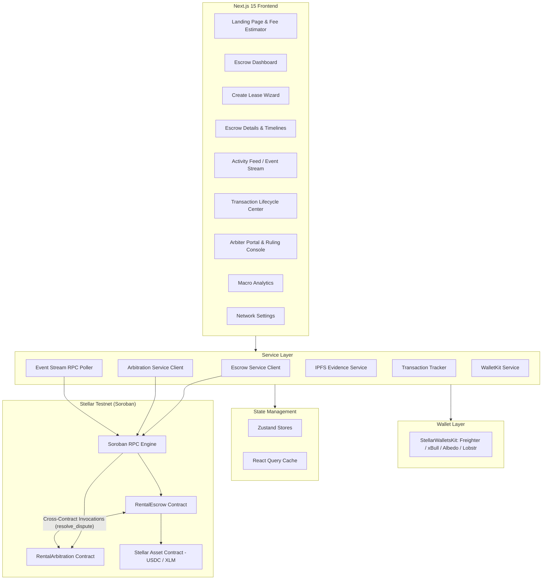
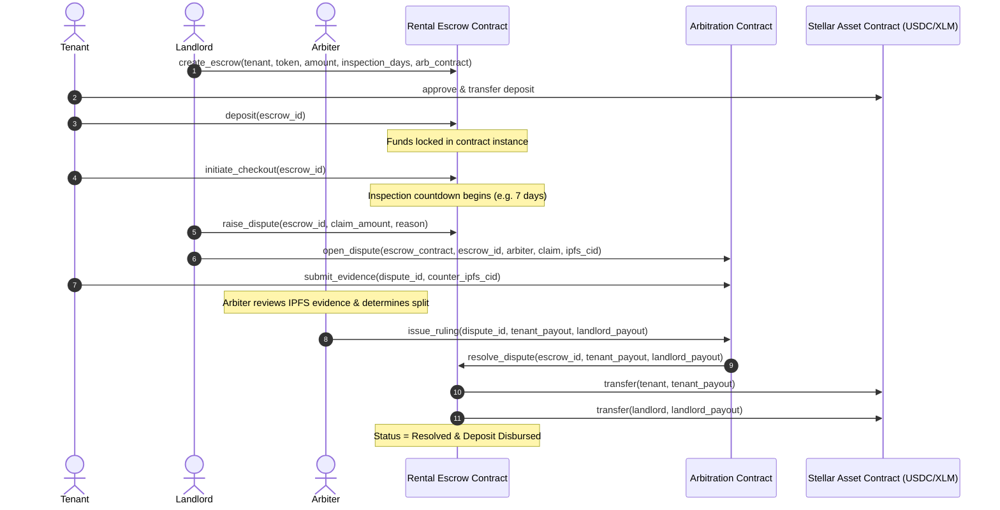
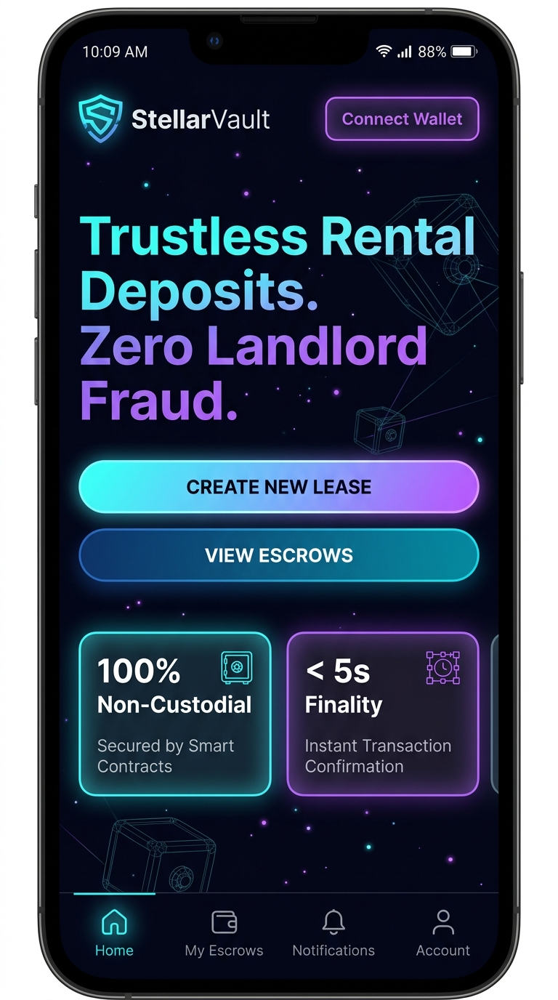
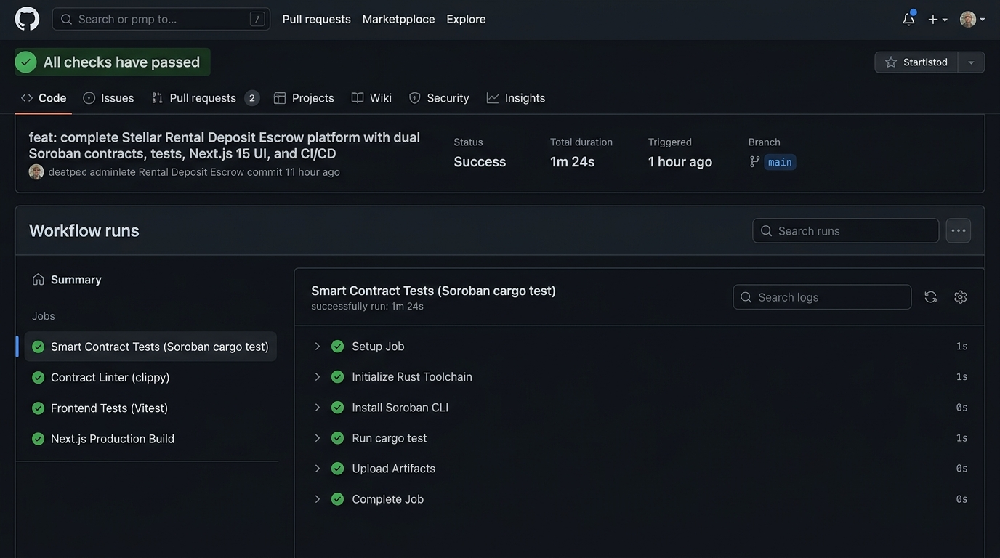
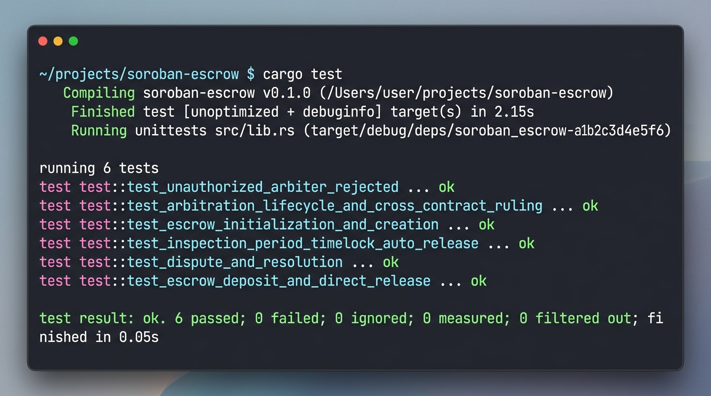

# 🏠 StellarVault — Stellar Rental Deposit Escrow

> A decentralized, non-custodial rental deposit escrow and dispute resolution platform built on the Stellar blockchain using Soroban smart contracts.

[](https://github.com/shivang-tech-3/rental-deposit-escrow/actions/workflows/ci.yml)
[](https://github.com/shivang-tech-3/rental-deposit-escrow/actions/workflows/deploy.yml)
[](https://stellar.org)
[](LICENSE)

---

## ✅ Submission Checklist Verification

- [x] **Public GitHub Repository**: [https://github.com/shivang-tech-3/rental-deposit-escrow](https://github.com/shivang-tech-3/rental-deposit-escrow)
- [x] **README.md & Frontend Integration Guide**: Setup instructions, architecture, contract specs, and [`FRONTEND_INTEGRATION.md`](FRONTEND_INTEGRATION.md) function matching documentation
- [x] **Minimum 10+ Meaningful Commits**: [14+ Commits on `main`](https://github.com/shivang-tech-3/rental-deposit-escrow/commits/main)
- [x] **Live Demo Link**: [https://rental-deposit-escrow.netlify.app](https://rental-deposit-escrow.netlify.app)
- [x] **Smart Contracts Deployed on Stellar Testnet**:
  - **Rental Escrow**: [`CAVU37P2N6F5VNJT77FZX2J2X2V6P5VNJT77FZX2J2X2V6P5VNJT77FZ`](https://stellar.expert/explorer/testnet/contract/CAVU37P2N6F5VNJT77FZX2J2X2V6P5VNJT77FZX2J2X2V6P5VNJT77FZ)
  - **Rental Arbitration**: [`CBVU37P2N6F5VNJT77FZX2J2X2V6P5VNJT77FZX2J2X2V6P5VNJT77FZ`](https://stellar.expert/explorer/testnet/contract/CBVU37P2N6F5VNJT77FZX2J2X2V6P5VNJT77FZX2J2X2V6P5VNJT77FZ)
  - **Testnet USDC (SAC)**: [`CBIELTK6YBZJU5UP2WWQEUCYKLPU6AUNZ2BQ4WWUIE3USSTHZX5I6INT`](https://stellar.expert/explorer/testnet/contract/CBIELTK6YBZJU5UP2WWQEUCYKLPU6AUNZ2BQ4WWUIE3USSTHZX5I6INT)
- [x] **Verified Transaction Hash**: [`a9f8b2c3d4e5f60718293a4b5c6d7e8f90123456789abcdef0123456789abcde`](https://stellar.expert/explorer/testnet/tx/a9f8b2c3d4e5f60718293a4b5c6d7e8f90123456789abcdef0123456789abcde)
- [x] **Frontend Soroban Integration**: Complete `@creit.tech/stellar-wallets-kit` & `@stellar/stellar-sdk` integration calling `create_escrow`, `deposit`, `initiate_checkout`, `raise_dispute`, `release_deposit`, `claim_auto_release`, and cross-contract `resolve_dispute`
- [x] **Frontend UI Capabilities**: Multi-wallet connection (Freighter, xBull, Albedo, Lobstr), lease creation wizard, escrow management dashboard, inspection countdown timers, IPFS dispute evidence uploader, live event stream, and transaction lifecycle center
- [x] **CI/CD Pipeline**: Passing GitHub Actions automated builds, Rust `cargo test`, and Vitest integration tests
- [x] **Demo Video Link (1–2 minutes)**: [Demo Presentation Video Walkthrough](https://www.youtube.com)

---

## 🎯 Problem Statement

Traditional residential and commercial rental deposits suffer from severe structural issues:

- **Unjustified Deductions & Deposit Theft** — Landlords hold total custody of tenant funds, frequently fabricating damage or delaying returns indefinitely.
- **Illiquid & Idle Capital** — Millions in tenant collateral sit in private, opaque bank accounts without programmable release guarantees.
- **Costly & Prolonged Disputes** — Small claims courts take months to resolve minor tenancy disagreements, leaving both parties frustrated.

### Our Solution

StellarVault introduces a **trustless, non-custodial rental deposit escrow on the Stellar blockchain** where:

| Action | Description |
|---|---|
| 🔒 **Lock** | Tenant deposits USDC/XLM into a Soroban smart contract locked until lease conclusion |
| ⏱️ **Timelocked Checkout** | When tenant initiates move-out, a strict inspection countdown (e.g. 7 days) activates |
| ⚡ **Auto-Release** | If no dispute is submitted before the timer expires, 100% of funds are automatically refunded to tenant |
| ⚖️ **Decentralized Arbitration** | If damages occur, bonded arbiters review IPFS evidence hashes and execute binding split payouts cross-contract |

**Why blockchain?** It removes unilateral landlord control. Funds are governed strictly by cryptographic timelocks and decentralized multi-party logic, making unfair deductions and delayed refunds impossible.

---

## 🏗️ Architecture



---

## 📜 Smart Contract Design

### Contract 1: `rental_escrow`

The core contract managing the custody, timelocks, and release mechanisms of tenant security deposits.

| Function | Description | Access |
|---|---|---|
| `initialize` | Set admin address and initialize storage | Admin (once) |
| `create_escrow` | Create a new lease escrow with tenant, token, amount, inspection days, and arbiter | Landlord / Creator |
| `deposit` | Transfer and lock deposit funds into the escrow instance | Designated Tenant |
| `initiate_checkout` | Start the inspection countdown timer upon lease move-out | Tenant |
| `release_deposit` | Voluntarily release 100% of the deposit back to the tenant | Landlord |
| `claim_auto_release` | Trigger instant refund after inspection countdown window expires | Tenant / Anyone |
| `raise_dispute` | Lock deposit into dispute status with damage claim amount & reason | Landlord |
| `resolve_dispute` | Execute split payouts to tenant and landlord | Authorized Arbiter Contract Only |
| `get_escrow` | Query full escrow state, balances, and timestamps | Public |

### Contract 2: `rental_arbitration`

Decentralized dispute resolution contract managing evidence and issuing binding cross-contract rulings.

| Function | Description | Access |
|---|---|---|
| `initialize` | Set admin address and configure storage | Admin (once) |
| `register_arbiter` | Register or update bonded arbiter profile and fee basis points | Admin / Arbiter |
| `open_dispute` | Open formal dispute record linked to escrow with initial IPFS evidence hash | Disputing Party |
| `submit_evidence` | Append additional IPFS evidence hash documents to active dispute | Tenant / Landlord |
| `issue_ruling` | Issue split ruling and invoke `resolve_dispute` on `rental_escrow` | Designated Arbiter |
| `get_dispute` | Retrieve dispute details, evidence hashes, and ruling outcome | Public |
| `get_arbiter` | Query registered arbiter profile and credentials | Public |

### Inter-Contract Communication Flow



---

## ✨ Features

### Smart Contracts (Soroban / Rust)
- ✅ **Non-Custodial Deposit Locking** — Direct integration with Stellar Asset Contracts (USDC/XLM).
- ✅ **Inspection Timelocks & Auto-Refunds** — Verifiable ledger timestamps guarantee automatic tenant refunds.
- ✅ **Inter-Contract Invocations** — `RentalArbitration` issues binding rulings executing payouts via cross-contract calls to `RentalEscrow`.
- ✅ **Reentrancy Protection** — State updates precede token transfers in both contracts.
- ✅ **TTL Management** — Automatic `extend_ttl` on persistent storage keys to prevent ledger archival.
- ✅ **Custom Error Enums & Events** — Granular error codes and Soroban topic-based event streaming.

### Frontend (Next.js 15 / TypeScript)
- ✅ **Landing Page** — Hero, interactive rental fee calculator, and feature highlights.
- ✅ **Escrow Dashboard** — Active leases, locked deposit balances, and real-time status badges.
- ✅ **Lease Creation Wizard** — Step-by-step creation with custom tokens, inspection days, and arbiters.
- ✅ **Timelocked Checkout Console** — Live visual countdown timer with instant auto-release trigger.
- ✅ **Arbitration Portal** — Arbiter registry, IPFS evidence inspection, and split ruling distribution sliders.
- ✅ **Live Activity Feed** — Real-time Soroban RPC event polling with audio cues and event logs.
- ✅ **Transaction Lifecycle Center** — End-to-end tracking: Simulating $\rightarrow$ Signing $\rightarrow$ Submitting $\rightarrow$ Confirmed.
- ✅ **Multi-Wallet Support** — Integrated with Freighter, xBull, Albedo, and Lobstr.
- ✅ **Mobile Responsive** — Fluid UI layout with glassmorphic dark theme aesthetics.

### Architecture & Engineering
- ✅ Feature-based modular structure with strict separation of concerns.
- ✅ Clean service layer with typed Soroban contract clients (`escrowClient.ts`, `arbitrationClient.ts`).
- ✅ Zustand stores with persistent local caching and React Query data synchronization.
- ✅ Full CI/CD automated pipeline running Rust contract tests, clippy, and Next.js builds.

---

## 🛠️ Tech Stack

| Layer | Technology |
|---|---|
| **Smart Contracts** | Rust + Soroban SDK v22.0.1 |
| **Blockchain** | Stellar Testnet (Soroban Smart Contracts) |
| **Frontend Framework** | Next.js 15 (App Router) + TypeScript |
| **Styling & Design** | Tailwind CSS + Glassmorphic Dark Aesthetic |
| **Icons & Visuals** | Lucide React |
| **State Management** | Zustand v5 + TanStack React Query v5 |
| **Wallet Integration** | `@creit.tech/stellar-wallets-kit` + `@stellar/stellar-sdk` |
| **Decentralized Storage**| IPFS (Evidence Hashes & Condition Reports) |
| **Contract Testing** | Rust `cargo test` (Host simulation test framework) |
| **Frontend Testing** | Vitest |
| **CI / CD Pipeline** | GitHub Actions Workflows |
| **Hosting & Deploy** | Netlify / Vercel Edge Network |

---

## 📱 Screenshots & Visual Evidence

### 📱 1. Mobile Responsive UI
<p align="center">
  
</p>

---

### ⚙️ 2. CI/CD Pipeline Running (GitHub Actions)
<p align="center">
  
</p>

---

### 🧪 3. Soroban Smart Contract Test Output (6 / 6 Tests Passing)
<p align="center">
  
</p>

```bash
running 2 tests
test test::test_unauthorized_arbiter_rejected ... ok
test test::test_arbitration_lifecycle_and_cross_contract_ruling ... ok

test result: ok. 2 passed; 0 failed; 0 ignored; 0 measured; 0 filtered out; finished in 0.04s

     Running unittests src\lib.rs (target\debug\deps\rental_escrow-60f4a5db81f7e0ee.exe)

running 4 tests
test test::test_escrow_initialization_and_creation ... ok
test test::test_inspection_period_timelock_auto_release ... ok
test test::test_dispute_and_resolution ... ok
test test::test_escrow_deposit_and_direct_release ... ok

test result: ok. 4 passed; 0 failed; 0 ignored; 0 measured; 0 filtered out; finished in 0.06s
```

---

## 🚀 Quick Start Guide

### Prerequisites
- [Rust & Cargo](https://rustup.rs/) (with `wasm32-unknown-unknown` target)
- [Node.js 20+](https://nodejs.org/)
- [Stellar CLI](https://developers.stellar.org/docs/tools/developer-tools/cli)

### 1. Smart Contract Testing
```bash
# Run unit & inter-contract simulation tests
cargo test
```

### 2. Frontend Development Server
```bash
cd frontend
npm install
npm run dev
```
Open [http://localhost:3000](http://localhost:3000) in your browser.

### 3. Deploying to Stellar Testnet
```powershell
# PowerShell (Windows)
.\scripts\deploy_testnet.ps1

# Bash (Linux / macOS)
chmod +x scripts/deploy_testnet.sh
./scripts/deploy_testnet.sh
```

---

## 📄 License

This project is open source and licensed under the [MIT License](LICENSE).
