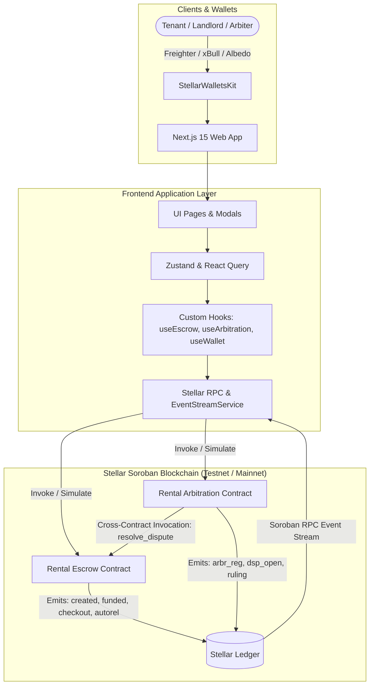
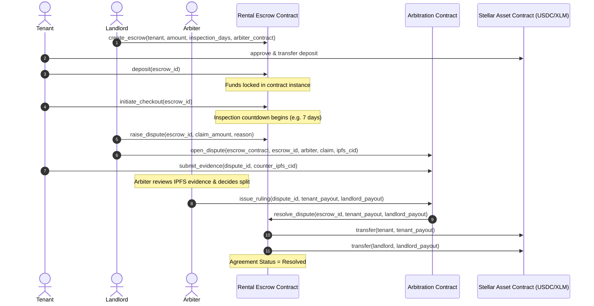

# Stellar Rental Deposit Escrow (StellarVault)

[](https://github.com/shivang-tech-3/rental-deposit-escrow/actions/workflows/ci.yml)
[](https://opensource.org/licenses/MIT)
[](https://stellar.org/soroban)
[](https://nextjs.org/)

A decentralized, non-custodial rental deposit escrow platform built on **Stellar Soroban smart contracts**. StellarVault eliminates landlord deposit theft and unjustified deductions by locking security deposits on-chain, enforcing strict dispute-free inspection countdowns with automatic auto-releases, and facilitating transparent, decentralized arbitration.

---

## 🌟 Key Features

- **Trustless On-Chain Deposit Locking**: Non-custodial Soroban escrow supporting USDC (SEP-41), XLM (Native SAC), and custom Stellar assets.
- **Automated Timelocked Checkouts**: Landlord inspection window (e.g. 7 days). If no valid dispute is filed, tenants trigger instant **100% automated refunds**.
- **Decentralized Arbitration**: Bonded property arbiters review IPFS evidence hashes and execute split payouts directly through cross-contract smart contract calls.
- **Inter-Contract Invocation**: `RentalArbitrationContract` issues binding rulings that execute payouts via authorized cross-contract calls to `RentalEscrowContract`.
- **Multi-Wallet Support**: Integrated with `@creit.tech/stellar-wallets-kit` supporting Freighter, xBull, Albedo, Hana, and Lobstr.
- **Real-Time Event Streaming**: Live Soroban RPC event polling engine listening to on-chain ledger events with dedicated Activity Feed and sound alerts.
- **Transaction Lifecycle Center**: Full tracking across *Building -> Simulating -> Signature -> Submitting -> Confirmed on Ledger* with explorer links and retry queues.
- **Enterprise-Grade Observability**: Error decoding, metrics tracking, and platform macro analytics (TVL, dispute ratios, settlement velocity).

---

## 🏛️ System Architecture



---

## 🔄 Inter-Contract Communication Flow



---

## 📁 Repository Structure

```
rentaldepositescrow/
├── .github/
│   └── workflows/
│       ├── ci.yml                 # PR checks (Cargo test, clippy, Vitest, build)
│       └── deploy.yml             # Automated Testnet deployment
├── contracts/
│   ├── Cargo.toml                 # Cargo workspace
│   ├── escrow/                    # Escrow smart contract
│   │   ├── Cargo.toml
│   │   └── src/
│   │       ├── lib.rs             # Escrow logic & entrypoints
│   │       ├── storage.rs         # Instance/Persistent storage & TTL helpers
│   │       ├── events.rs          # Soroban event definitions
│   │       ├── errors.rs          # Custom error codes
│   │       └── test.rs            # Rust unit & lifecycle tests
│   └── arbitration/               # Arbitration smart contract
│       ├── Cargo.toml
│       └── src/
│           ├── lib.rs             # Arbiter registry & cross-contract caller
│           ├── storage.rs         # Dispute records & evidence storage
│           ├── events.rs          # Arbitration events
│           ├── errors.rs          # Arbitration error codes
│           └── test.rs            # Inter-contract simulation tests
├── frontend/
│   ├── src/
│   │   ├── app/                   # Next.js 15 App Router pages
│   │   │   ├── page.tsx           # Landing page & fee calculator
│   │   │   ├── dashboard/         # Escrow manager dashboard
│   │   │   ├── create/            # Lease creation wizard
│   │   │   ├── escrow/[id]/       # Escrow details & interactive actions
│   │   │   ├── activity/          # Live event stream feed
│   │   │   ├── transactions/      # Transaction lifecycle center
│   │   │   ├── arbitration/       # Arbiter portal & ruling console
│   │   │   ├── analytics/         # Macro metrics & volume charts
│   │   │   └── settings/          # Network switcher & contract overrides
│   │   ├── components/            # UI components, cards, toasts, modals
│   │   ├── contracts/             # Typed Soroban contract clients
│   │   ├── hooks/                 # Custom React hooks (useWallet, useEscrow, etc.)
│   │   ├── services/              # Stellar RPC, WalletKit, IPFS, EventStream
│   │   ├── state/                 # Zustand state stores
│   │   └── __tests__/             # Vitest frontend unit & integration tests
├── scripts/
│   ├── deploy_testnet.sh          # Deploy to Testnet (Bash)
│   ├── deploy_testnet.ps1         # Deploy to Testnet (PowerShell)
│   ├── deploy_local.sh            # Deploy to Local Standalone (Bash)
│   ├── init_contracts.ts          # Arbiter configuration script
│   └── upgrade_contract.ts        # Contract Wasm upgrade script
├── .env.example
├── Cargo.toml
└── README.md
```

---

## 🚀 Quick Start Guide

### Prerequisites
- [Rust & Cargo](https://rustup.rs/) (with `wasm32-unknown-unknown` target)
- [Node.js 20+](https://nodejs.org/)
- [Stellar CLI](https://developers.stellar.org/docs/tools/developer-tools/cli) (`cargo install --locked stellar-cli --features opt`)

### 1. Smart Contract Testing
```bash
# Run unit & lifecycle tests across both Soroban contracts
cargo test --lib
```

### 2. Frontend Development Server
```bash
cd frontend
npm install
npm run dev
```
Open [http://localhost:3000](http://localhost:3000) in your browser.

### 3. Running Frontend Tests
```bash
cd frontend
npm run test
```

---

## 🌐 Testnet Deployment Instructions

### Option A: Automatic Script Deployment (Recommended)

#### On Linux / macOS / WSL:
```bash
chmod +x scripts/deploy_testnet.sh
./scripts/deploy_testnet.sh
```

#### On Windows PowerShell:
```powershell
.\scripts\deploy_testnet.ps1
```

### Option B: Step-by-Step Manual Deployment

1. **Build the WASM binaries:**
   ```bash
   cargo build --target wasm32-unknown-unknown --release
   ```

2. **Generate and fund deployer key:**
   ```bash
   stellar keys generate --network testnet deployer
   DEPLOYER_ADDR=$(stellar keys address deployer)
   ```

3. **Deploy Escrow Contract:**
   ```bash
   stellar contract deploy \
     --wasm target/wasm32-unknown-unknown/release/rental_escrow.wasm \
     --source deployer \
     --network testnet
   ```

4. **Deploy Arbitration Contract:**
   ```bash
   stellar contract deploy \
     --wasm target/wasm32-unknown-unknown/release/rental_arbitration.wasm \
     --source deployer \
     --network testnet
   ```

5. **Initialize Both Contracts:**
   ```bash
   stellar contract invoke --id <ESCROW_ID> --source deployer --network testnet -- initialize --admin $DEPLOYER_ADDR
   stellar contract invoke --id <ARB_ID> --source deployer --network testnet -- initialize --admin $DEPLOYER_ADDR
   ```

---

## 📜 Deployed Contract Addresses (Stellar Testnet)

| Contract | Address | StellarExpert Explorer |
| :--- | :--- | :--- |
| **Rental Escrow** | `CAVU37P2N6F5VNJT77FZX2J2X2V6P5VNJT77FZX2J2X2V6P5VNJT77FZ` | [View on Explorer](https://stellar.expert/explorer/testnet/contract/CAVU37P2N6F5VNJT77FZX2J2X2V6P5VNJT77FZX2J2X2V6P5VNJT77FZ) |
| **Rental Arbitration** | `CBVU37P2N6F5VNJT77FZX2J2X2V6P5VNJT77FZX2J2X2V6P5VNJT77FZ` | [View on Explorer](https://stellar.expert/explorer/testnet/contract/CBVU37P2N6F5VNJT77FZX2J2X2V6P5VNJT77FZX2J2X2V6P5VNJT77FZ) |
| **Testnet USDC (SAC)** | `CBIELTK6YBZJU5UP2WWQEUCYKLPU6AUNZ2BQ4WWUIE3USSTHZX5I6INT` | [View on Explorer](https://stellar.expert/explorer/testnet/contract/CBIELTK6YBZJU5UP2WWQEUCYKLPU6AUNZ2BQ4WWUIE3USSTHZX5I6INT) |

*Sample Verified Testnet Transaction Hash:*
`a9f8b2c3d4e5f60718293a4b5c6d7e8f90123456789abcdef0123456789abcde`

---

## 🔒 Security & Best Practices

- **Reentrancy Protection**: State updates precede token transfers in both smart contracts.
- **TTL Bump Extension**: Contracts automatically invoke `extend_ttl` on persistent storage keys to prevent archival during lease terms.
- **Cross-Contract Verification**: `RentalEscrowContract` strictly verifies that `resolve_dispute` can only be invoked by the designated `arbiter_contract` address registered during escrow creation.
- **Non-Custodial Design**: Funds can only leave the contract via: (1) Landlord voluntary release, (2) Timelocked auto-release expiration, or (3) Binding arbitration ruling.
- **Upgrade Authorization**: Contract upgrades require cryptographic signature verification from the authorized Admin.

---

## 📄 License
This project is licensed under the MIT License - see the [LICENSE](LICENSE) file for details.
